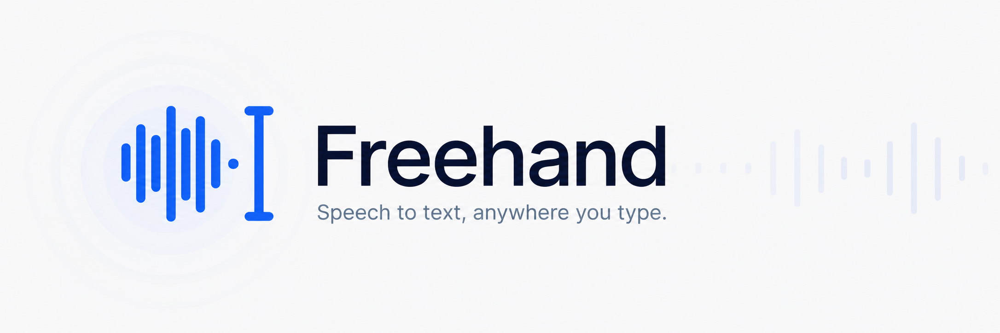

  <picture>
    <source media="(prefers-color-scheme: dark)" srcset="branding/freehand-readme-dark.png" />
    <source media="(prefers-color-scheme: light)" srcset="branding/freehand-readme-light.png" />
    
  </picture>

Freehand is a lightweight Windows client for speech-to-text services you
choose. Use a global shortcut to dictate into the application where you are
already working, with models running on your PC, your network, or a compatible
hosted service.

**Free forever. Open source. No Freehand subscription or account.** Your chosen
provider or hosting may have its own costs. You do not need a dedicated local
GPU: send inference to another machine to keep this PC's memory and GPU
available for your other work, or run your models locally if you prefer.

The current alpha is about an 8 MB installer or a 15 MB portable executable.
Freehand stays compact by leaving model inference and model storage on the
speech infrastructure you choose. These download sizes exclude WebView2 and
your inference services; transcription time depends on the model, hardware,
network, and optional cleanup stage.

[Download the latest alpha](https://github.com/tnware/freehand-stt/releases) ·
[Get started](https://tnware.github.io/freehand-stt/docs/getting-started/) ·
[Read the documentation](https://tnware.github.io/freehand-stt/docs/)

## Choose your workflow

Start with a compatible speech endpoint and model, then choose how to finish:

- **Dictation without cleanup** — deliver the speech model's transcript unchanged.
- **Custom cleanup** — use a separate chat endpoint, model, and your own instructions.
- **S1-mini by Superwhisper** — use the built-in profile with style, structure,
  and context controls for this optional English cleanup model. You provide
  its inference server; Freehand does not download or host the model.

Speech and cleanup can run on your PC, across your LAN, or through separately
chosen hosted services. If cleanup fails or returns empty text, Freehand falls
back to the raw transcript. Enable bounded session history to retain both
versions after successful cleanup.

[Configure transcript cleanup](https://tnware.github.io/freehand-stt/docs/guides/post-processing/)

## Highlights

- Toggle recording or hold to talk from any Windows application.
- Use independent OpenAI-compatible endpoints for speech recognition,
  optional transcript cleanup, and optional speech playback.
- Transcribe microphone input or a selected audio file.
- Use local voice detection for silence trimming, automatic stop, and
  pause-aware checkpoints.
- Insert voice transcripts only when the original target remains safe, or copy
  them explicitly.
- Opt into bounded, memory-only history; configure or disable the native status overlay.

Freehand does not bundle a model, inference server, or heavyweight local
runtime.

## Install

Freehand currently requires Windows 11 with WebView2 and a reachable compatible
speech-to-text endpoint. Download the per-user installer from
[GitHub Releases](https://github.com/tnware/freehand-stt/releases).

The current alpha is not Authenticode-signed, so Windows may identify its
publisher as unknown. Verify manual downloads against the published
`SHA256SUMS` file.

Follow [Get started](https://tnware.github.io/freehand-stt/docs/getting-started/)
to connect a server, select a microphone, configure a shortcut, and complete
your first dictation.

## Documentation

- [Install and update Freehand](https://tnware.github.io/freehand-stt/docs/guides/windows-installer/)
- [Connect a speech server](https://tnware.github.io/freehand-stt/docs/guides/connect-a-server/)
- [Use Freehand](https://tnware.github.io/freehand-stt/docs/guides/using-freehand/)
- [Privacy and safety](https://tnware.github.io/freehand-stt/docs/guides/privacy-and-safety/)
- [Troubleshooting](https://tnware.github.io/freehand-stt/docs/guides/troubleshooting/)

## Contributing

Bug reports, interoperability results, documentation fixes, design feedback,
and code contributions are welcome. See [CONTRIBUTING.md](CONTRIBUTING.md) for
development setup and pull-request guidance.

Please report vulnerabilities through GitHub private vulnerability reporting,
not a public issue. Freehand is available under the [MIT License](LICENSE).
